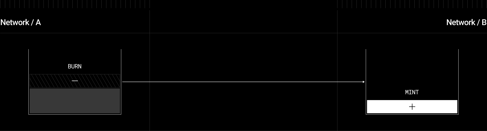

## Documentation

This ERC20 token implementation utilizes LayerZero library for Omnichain Fungible token ([OFT](https://docs.layerzero.network/contracts/oft)) and Permit functionality which allows gasless token approvals.



## 1) Prerequisite

#### Installing dependencies

Use proper node version:

```bash
nvm use
```

If using MacOS:

```bash
pnpm i @nomicfoundation/edr-darwin-arm64
```

We recommend using `pnpm` as a package manager (but you can of course use a package manager of your choice):

```bash
pnpm install
```

## 2) Compiling and Testing Contracts

Compile contracts:

```bash
forge compile
```

Running tests:

```bash
forge test
```

## 2) Deploying Contracts

Set up deployer wallet/account:

> **Please read carefully:** To achieve same contract addresses on both network use the same nonce on both chains.

- Rename `.env.example` -> `.env`
- Choose your preferred means of setting up your deployer wallet/account:

To deploy your contracts to your desired blockchains, run the following command in your project's folder:

```bash
npx hardhat lz:deploy
```

## 3) Configure Chains

Define chains to support within [layerzero.config](./layerzero.config.ts) with [list of supported networks](https://docs.layerzero.network/contracts/endpoint-addresses#mainnet-addresses)

Wire up contracts:

```bash
npx hardhat lz:oapp:wire --oapp-config layerzero.config.ts
```

See configuration:

```sh
npx hardhat lz:oapp:config:get:default
```

## 4) Bridge Tokens

To bridge from Sepolia Base to Seplia Ethereum:

```bash
npx hardhat run scripts/bridge.ts --network base_sepolia
```

And other way around:

```bash
npx hardhat run scripts/bridge.ts --network sepolia
```
